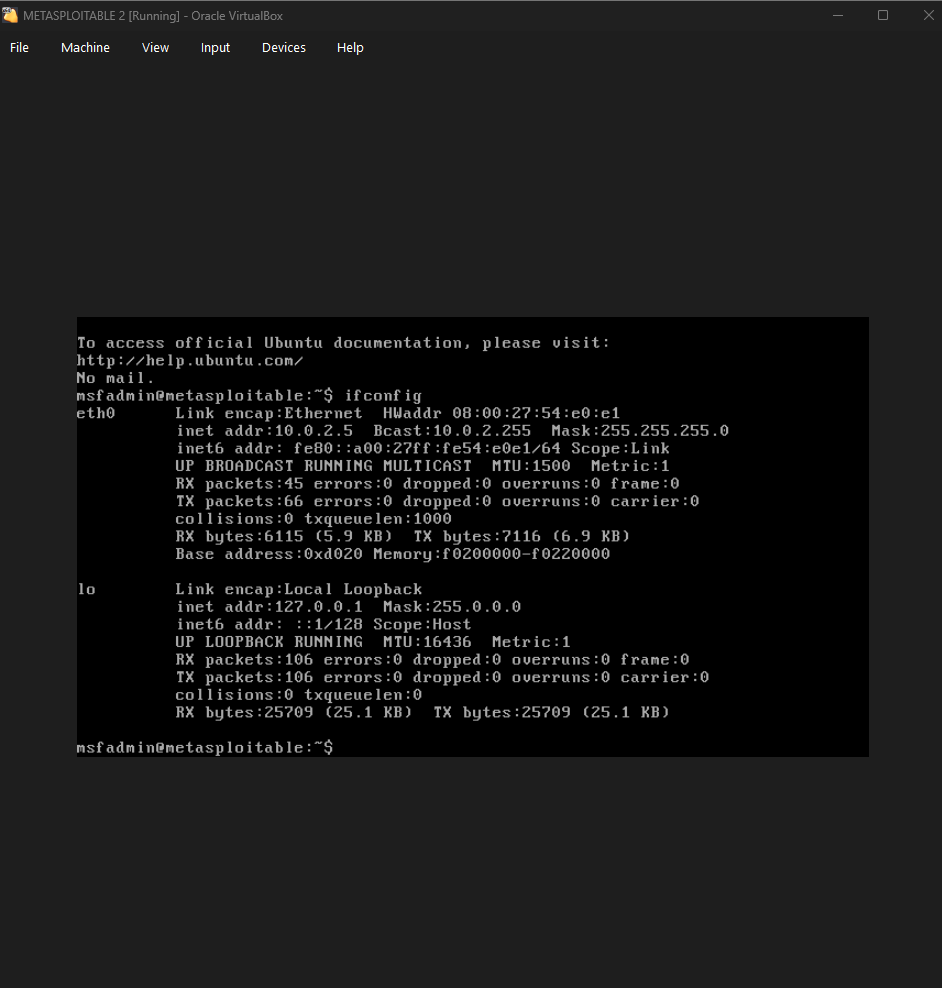

# Ping Test
**Attacker VM:** Kali Linux
**Victim VM:** Metasploitable 2
## Results
After getting in Metasploitable I made ifconfig to know it ip then in kali ran the ping command 
## Outcome 
I Successfully established a connection between the two vms showing I set up my Nat Network correctly 

  
  

